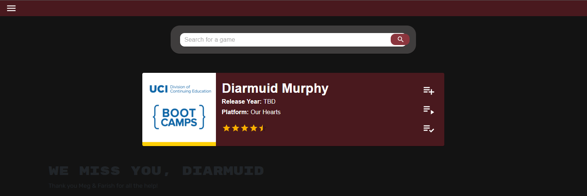

# **Mist Games**


Mist Games is a comprehensive application designed to help gamers organize and track their gaming wishlist. Whether you're looking to plan future gaming experiences or keep track of completed titles, Mist Games provides a seamless and user-friendly interface to manage your gaming library.

Key highlights of the project include:
- **Wishlist Management:** Add, complete, or remove games from your personalized wishlist.
- **Dynamic Game Data:** Leverages the RAWG API to fetch detailed information about games.
- **Modern Design:** Built with React and styled with Material UI for a clean and responsive user interface.
- **Scalable Back-End:** Powered by GraphQL, Node.js, and Express.js to ensure fast and efficient data handling.


## Features

1) **Add Game to Wishlist:** Users can input a **game** they wish to play in the future and add it to their **wishlist**.

2) **Mark Game as Completed:** Users can mark a **game** as **completed** once they have played it.

3) **Delete Game from Wishlist:** Users can **remove** a **game** from their **wishlist** if they no longer wish to play it.

## Tools Used

- **[RAWG API](https://rawg.io/):** Used to retrieve data for the games.
- **GraphQL w/ Node.js & Express.js:** For building the back-end.
- **React:** For developing the front-end.
- **Material UI:** For styling the application.

## Installation

Clone the Repository: 
```bash
git clone https://github.com/haydencfb/mist-game
```

Install the Packages
```bash
npm install
```
Build the Project

```bash
npm run build
```

Start the Development Server
```
npm run develop
```


## Screenshot




## Deployment:

https://mist-game.onrender.com/

## Contributors

[Hayden Fitzpatrick-Brintle](https://github.com/haydencfb)

[Isaiah SKidmore](https://github.com/IsaiahSkidmore)

[Daniel Olaes](https://github.com/dolaes)

[John Marquez](https://github.com/jvhnn)

